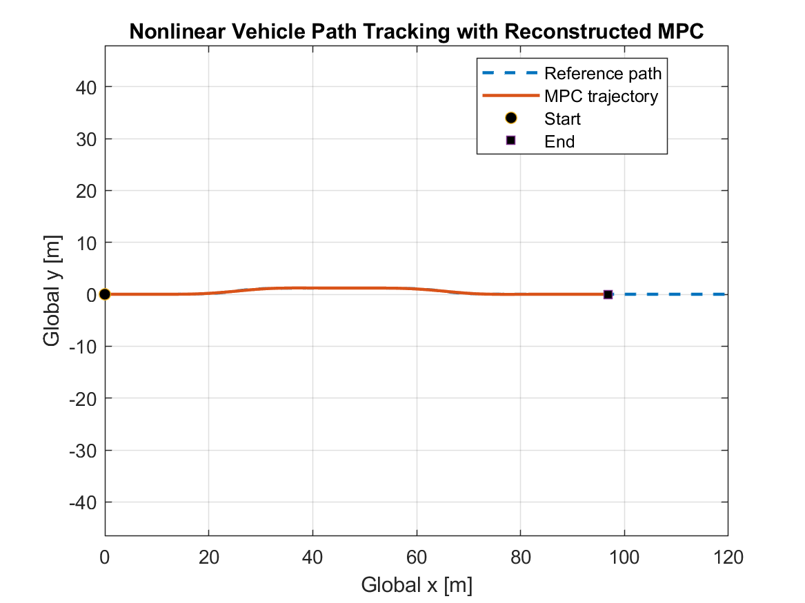
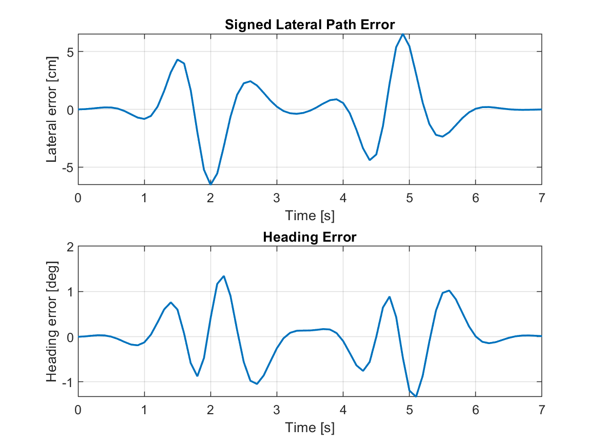
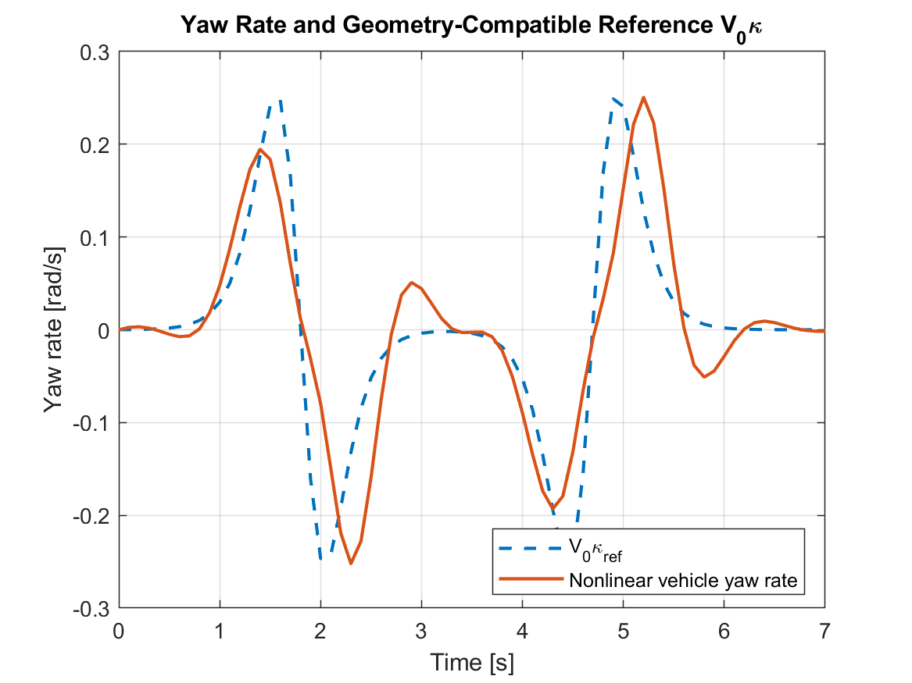
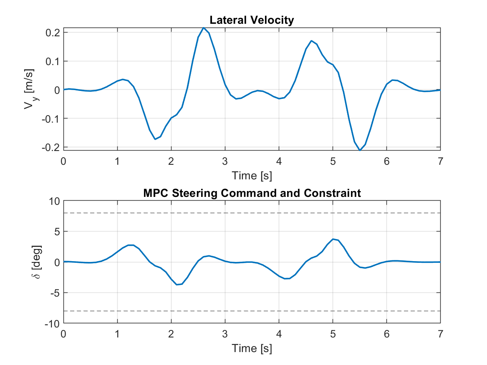
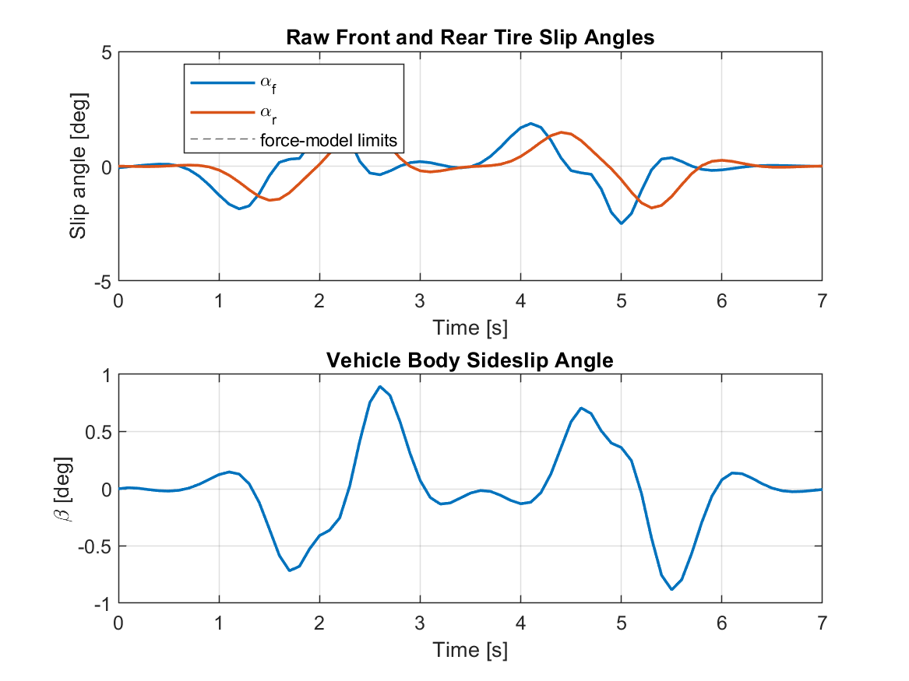
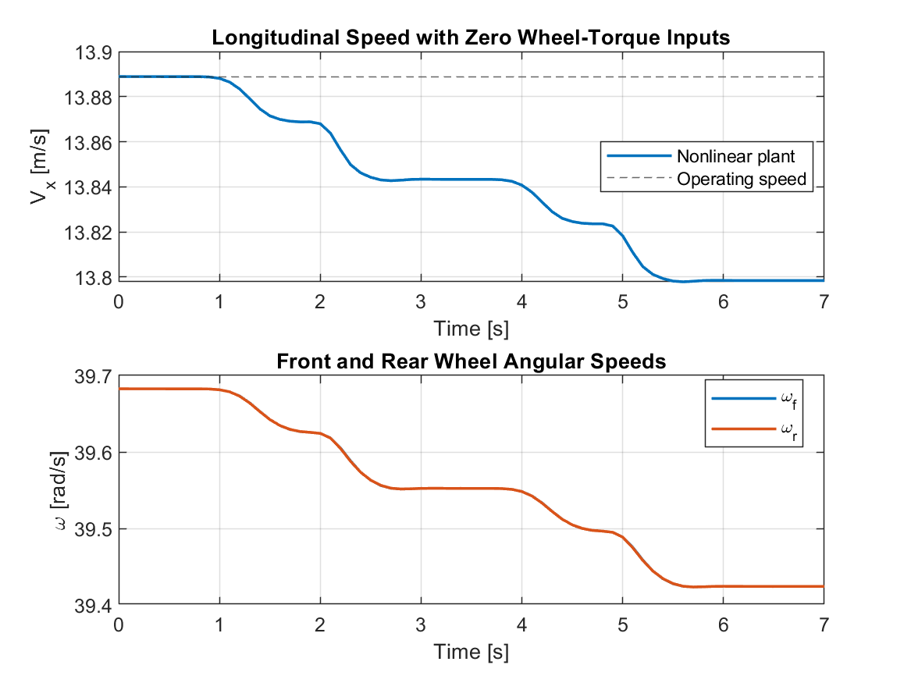
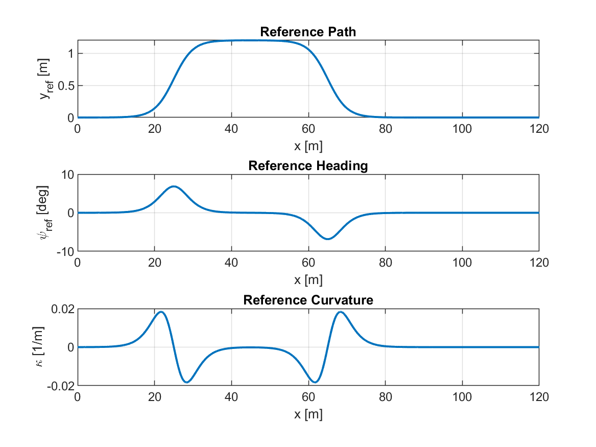

# Vehicle Lateral Dynamics with Model Predictive Control

A cleaned, reproducible MATLAB project for **nonlinear vehicle path tracking with Model Predictive Control (MPC)**.

The project combines:

- a source-derived five-state nonlinear vehicle model;
- front/rear tire slip-angle and longitudinal-slip calculations;
- combined-slip tire-force coupling and saturation;
- straight-line operating-point linearization;
- local lateral controllability analysis;
- a reconstructed four-state lateral path-error MPC;
- nonlinear closed-loop path-following simulation;
- steering, tire-slip, sideslip, yaw-rate, and longitudinal-state analysis;
- automatic quantitative result export.

> **Important reconstruction note:** the archived Simulink model referenced an MPC workspace object named `mpcobj` and a file named `MPCtask.mat`. Those files were not present in the archived project. Therefore, the exact original MPC weights, steering constraints, and optimizer settings could not be recovered. This repository preserves the source-derived vehicle model and the recovered MPC timing, while clearly documenting the newly reconstructed controller tuning.

## Quick start

1. Clone or download this repository.
2. Open MATLAB and set the repository as the **Current Folder**.
3. Run:

```matlab
run_vehicle_lateral_mpc_project
```

The script regenerates the files in `results/`.

**Validated with:** MATLAB R2022b  
**Toolboxes required:** none for the cleaned runner.

## Source-derived nonlinear vehicle model

The nonlinear plant uses the five-state vector

$$
x =
[V_x,\ V_y,\ r,\ \omega_f,\ \omega_r]^T,
$$

with inputs

$$
u =
[\delta,\ T_f,\ T_r]^T.
$$

Here:

- $V_x$: longitudinal velocity;
- $V_y$: lateral velocity;
- $r$: yaw rate;
- $\omega_f,\omega_r$: front/rear wheel angular speed;
- $\delta$: steering angle;
- $T_f,T_r$: front/rear wheel torque.

For this lateral-control experiment, the wheel torques are held at zero and the MPC manipulates steering only.

### Main vehicle parameters

| Parameter | Value |
|---|---:|
| Vehicle mass | 1000 kg |
| Yaw inertia | 2000 kg·m² |
| Wheel inertia | 30 kg·m² |
| CG to front axle | 1.35 m |
| CG to rear axle | 1.50 m |
| Wheelbase | 2.85 m |
| Wheel radius | 0.35 m |
| Longitudinal-slip limit | ±0.10 |
| Slip-angle limit | ±5° |

See [`docs/model_and_mpc_notes.md`](docs/model_and_mpc_notes.md) for the model equations and reconstruction details.

## Operating point and local lateral model

The cleaned analysis uses a straight-line operating point at **50 km/h**:

| Quantity | Value |
|---|---:|
| Longitudinal speed | 13.888889 m/s |
| Front/rear wheel speed | 39.682540 rad/s |
| Lateral velocity | 0 m/s |
| Yaw rate | 0 rad/s |
| Equilibrium residual | 0.000e+00 |

The local steering-to-lateral subsystem uses states $[V_y,r]^T$.

| Linear-model check | Result |
|---|---:|
| Controllability rank | **2 / 2** |
| Pole 1 | $-6.17546 + 1.75473j$ |
| Pole 2 | $-6.17546 - 1.75473j$ |

## Reconstructed MPC

The cleaned MPC uses the state

$$
z =
[e_y,\ e_\psi,\ V_y,\ r]^T,
$$

where $e_y$ is lateral path error and $e_\psi$ is heading error.

Recovered from the archived Simulink MPC block:

| MPC setting | Value | Origin |
|---|---:|---|
| Sample time | 0.10 s | **source-derived** |
| Prediction horizon | 20 | **source-derived** |
| Simulation duration | 7 s | **source-derived** |

Newly documented reconstruction choices:

| MPC setting | Value |
|---|---:|
| Steering bound | ±8.0° |
| $Q$ diagonal | [80, 30, 0.5, 2.0] |
| Steering penalty $R$ | 2.0 |
| Steering-move penalty $S$ | 20.0 |

The finite-horizon QP is solved exactly when its unconstrained optimum lies inside the steering bounds. A toolbox-free accelerated projected-gradient fallback is included for cases in which a bound becomes active.

For the published run, the unconstrained optimum remained feasible at every control step, so the constrained fallback was never required.

## Path tracking



**Figure 1. Nonlinear vehicle path tracking with reconstructed MPC.**  
The nonlinear five-state plant follows a smooth double-lane-change-like reference generated for the cleaned reproducibility experiment.

### Tracking performance

| Metric | Value |
|---|---:|
| Lateral path-error RMSE | **2.300 cm** |
| Maximum lateral path error | **6.539 cm** |
| Heading-error RMSE | **0.544°** |
| Maximum heading error | **1.344°** |
| Yaw-rate vs. $V_0\kappa$ RMSE | 0.063435 rad/s |

## Path and heading errors



**Figure 2. Lateral path error and heading error.**  
The maximum lateral path deviation is approximately 6.54 cm, while the heading error remains below 1.34° in magnitude for the tested maneuver.

## Yaw-rate response



**Figure 3. Nonlinear yaw rate compared with the geometry-compatible reference $V_0\kappa_{ref}$.**  
The yaw-rate curve is not used as a separately imposed tracking objective; it provides an interpretable comparison between the nonlinear response and the reference-path curvature.

## Lateral velocity and steering



**Figure 4. Lateral velocity and MPC steering command.**

| Steering metric | Value |
|---|---:|
| Maximum absolute steering | 3.725° |
| Steering bound | ±8.0° |
| Steering-saturation fraction | 0.0% |

The steering constraint is comfortably inactive in this experiment.

## Tire slip and vehicle sideslip



**Figure 5. Raw front/rear tire slip angles and vehicle body sideslip.**

| Tire-state metric | Value |
|---|---:|
| Maximum raw front slip angle | 2.520° |
| Maximum raw rear slip angle | 1.833° |
| Tire slip-angle force limit | ±5° |
| Maximum raw longitudinal slip | 0.000436 |

The tested trajectory remains within the archived tire model's slip-angle and longitudinal-slip saturation limits.

## Longitudinal and wheel states



**Figure 6. Longitudinal speed and front/rear wheel angular speeds.**  
Because wheel torques are held at zero, steering-induced tire forces cause a small longitudinal-speed reduction.

| Longitudinal metric | Value |
|---|---:|
| Maximum speed reduction | 0.090966 m/s |

## Reference-path geometry



**Figure 7. Reference lateral position, heading, and curvature.**  
The path is a newly selected smooth double-lane-change-like trajectory used to exercise the reconstructed MPC. It is not claimed to be the unrecovered reference trajectory from the legacy Simulink workspace.

## Optimizer verification

The first modernization attempt used basic projected gradient and revealed an important numerical issue: the solver reached its iteration cap. The public runner corrects that problem.

For the validated run:

| Optimizer check | Value |
|---|---:|
| QP Hessian condition estimate | 1.075e+04 |
| Constrained-fallback fraction | 0.0% |
| Mean fallback iterations | 0.0 |
| Maximum fallback iterations | 0 |
| Maximum QP residual | **1.273e-11** |

Because the unconstrained optimum remained inside ±8.0° for every MPC step, it is also the exact constrained optimum for this experiment.

## Repository structure

```text
vehicle-lateral-dynamics-mpc/
├── README.md
├── .gitignore
├── run_vehicle_lateral_mpc_project.m
├── docs/
│   └── model_and_mpc_notes.md
└── results/
    ├── vehicle_lateral_mpc_metrics.csv
    ├── vehicle_lateral_mpc_summary.txt
    ├── mpc_settings.csv
    ├── full_linearized_A.csv
    ├── full_linearized_B.csv
    ├── lateral_A.csv
    ├── lateral_B.csv
    ├── mpc_augmented_Ad.csv
    ├── mpc_augmented_Bd.csv
    ├── mpc_augmented_Ed.csv
    └── figures/
        ├── 01_mpc_path_tracking.png
        ├── 02_path_and_heading_errors.png
        ├── 03_yaw_rate_tracking.png
        ├── 04_lateral_velocity_and_steering.png
        ├── 05_tire_slip_and_sideslip.png
        ├── 06_longitudinal_and_wheel_states.png
        └── 07_reference_path_geometry.png
```

Local runs also generate `.fig` files and `vehicle_lateral_mpc_results.mat`; these binary outputs are excluded from Git by default.

## Limitations

- The original `MPCtask.mat` / `mpcobj` was missing, so the exact legacy MPC tuning cannot be reproduced.
- The path, steering constraint, quadratic weights, and self-contained QP implementation are newly documented reconstruction choices.
- The controller uses a local four-state lateral prediction model, while the simulation plant is the nonlinear five-state model.
- The experiment is simulation-only and is not a hardware or road-test validation.
- Tire coefficients are inherited from the archived academic model and are not experimentally identified vehicle parameters.
- Front/rear normal loads are fixed in the archived tire model; dynamic load transfer is not included.
- Aerodynamic drag, rolling resistance, actuator dynamics, sensor noise, and steering-rate constraints are omitted.
- The published maneuver does not activate the steering bound, so the constrained fallback solver is included but not exercised by this particular test.
- No formal robust-MPC, stability, or recursive-feasibility guarantee is claimed.

## Background

This repository modernizes an archived Simulink project on vehicle lateral dynamics and MPC. The main objective of the public version is reproducibility: preserve the recoverable nonlinear vehicle model and MPC timing, identify the missing legacy dependency explicitly, reconstruct a technically transparent path-tracking controller, and validate it against the nonlinear plant with quantitative diagnostics.

## Author

**Mohammad Hossein Fakouri**  
Robotics, control, vehicle dynamics, and learning-based control  
GitHub: [mhfakouri](https://github.com/mhfakouri)  
Website: [mhfakouri.com](https://mhfakouri.com/)
